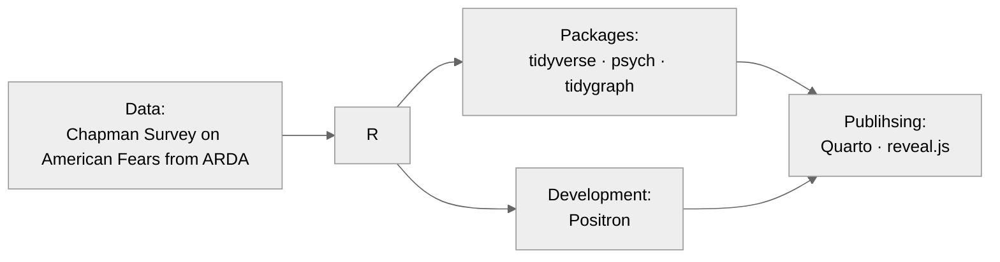

<!--
ideas:
- gnome sort commits
- https://rfortherestofus.com/2021/08/rstudio-project-structure
- https://jonathansoma.com/fancy-github/github-profile/
- https://www.r-bloggers.com/2025/05/keep-your-r-code-clean-and-consistent-with-air/
- https://medium.com/@chijiokeokorji/from-meh-to-marvelous-the-ultimate-guide-to-crafting-a-killer-github-profile-8dd3f6c6d602
-->

## hi, i'm asher ♡


<div style="padding: 0px;">
  <a href="linkedin.com/asherbruce/"></a>
  <a></a>
</div>

*Data Science and Political Economy Student at [The College of Idaho](collegeofidaho.edu)*

### About Me

```r
asher <- data.frame(
  pronouns          = c("she", "her", "hers"),
  code              = c("R", "Python", "HTML", "CSS"),
  tools             = c("tidyverse", "regex", "Shiny", "Quarto"),
  statistic_methods = c("Factor Analysis", "ANOVA", "Regression", "PCA")
)
```


### What I'm learning

- **Data visualization in ggraph**
  - *Network analysis*
  - *Factor structure*
- **Data cleaning in tidyverse**
  - *Preprocessing with recipes*
  - *Parsing text with regex*
- **Psychometric methods**
  - *Assessing test validity with exploratory factor analysis*
  - *Scoring tests with item response theory*

## Sample project: [Factor Analysis - Chapman University's American Fears Survey (Wave 10)](https://github.com/asleepwithabook/individual_project)

### Tools



### Overview
The [Chapman University Survey on American Fears (CSAF)](thearda.com/data-archive?fid=CSAF2024&tab=1) collects data on Americans' fears, attitudes, and behaviors. Using factor analysis, we can see how these categories and the items within them are related.

> *Are all the questions about fear of pollution measuring a "fear of pollution" trait?*  
> *Does news consumption load onto the same factor as perceptions of political selfishness?*

#### Process
Survey data tend to be messy. The CSAF doesn't define its own variables, so it didn't mark questions as reverse-scaled. After reversing the necessary questions, they need to be labeled so that factors can be correctly identified.

> The name 'Q17A' doesn't provide enough information to define a factor as measuring religiosity.

This required parsing the codebook using regex, pulling the question text and possible answers into a readable format. Once the data is readable, the factor analysis can be performed. I used `psych::fa()` to perform a hierarchical factor analysis.

### Results

<p align="center">
  <a href="https://github.com/asleepwithabook/individual_project/higher_order_structure.png">
    
  </a>
</p>

The first-order factors explain the variance of groups of individual questions, which I've labeled to reflect the common themes in questions that have significant loadings ($|x| > 0.4$) on them. Higher-order factors explain the variance of groups of first-order factors, allowing us to group factors for analysis. 

>Orphans are first-order factors that don't have significant loadings on any higher-order factors. Strength of loadings are represented by line weight and alpha value.

### Takeaways

In this project, I learned how to use R to:
- Clean large datasets for analysis
- Perform hierarchical factor analyses
- Create maps in tidygraph and ggraph

I learned how to use Quarto to:
- Organize code for readability
- Create beautiful presentations
